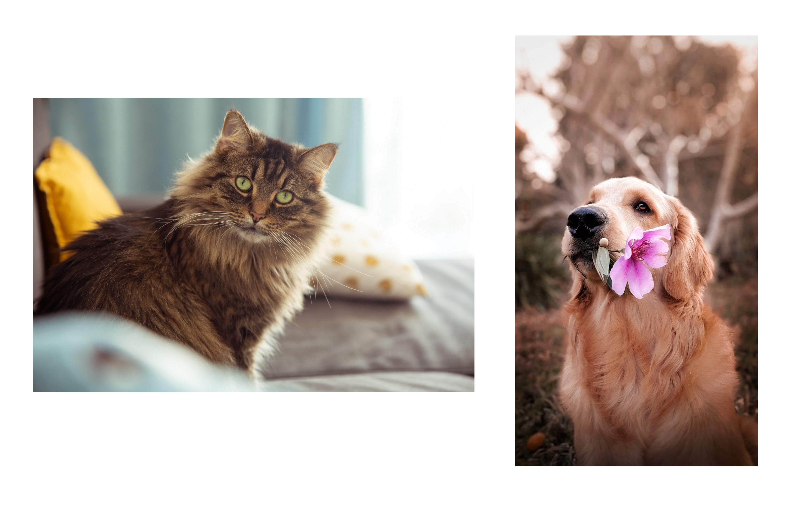
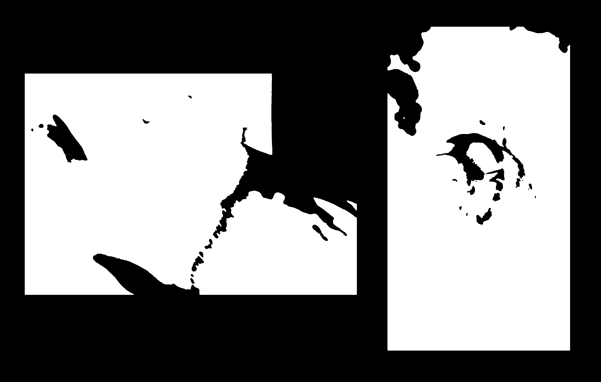
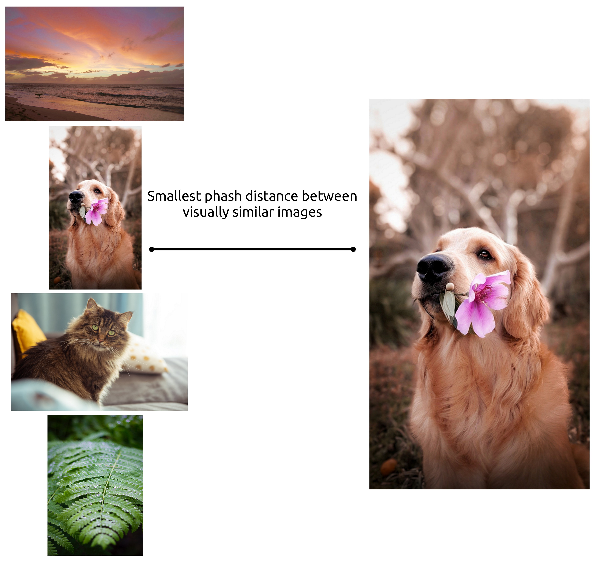

# fromthumb

Search high-resolution images for a match based on a smaller thumbnail image.

## Problem

Given a PDF document containing multiple pages of non-overlapping images, we want to:

- convert the PDF to images
- extract sub-images from a larger image
- find high quality image given a smaller thumbnail

## Process

### Convert PDF to images

Use ImageMagick on Linux to perform the conversion:

```bash
# Convert $INPUT_FILE to multiple images 1920px wide, saved as 'page-0.png` etc.
convert -density 150 -antialias $INPUT_FILE -resize 1920x -quality 100 "page-%d.png"
```

This dumps our PDF pages as images:



### Extract sub-images

Pull images patches out of the larger pages:

```bash
cargo run --bin decollage -- example/pages example/patch --debug example/debug
```

This identifies and extracts subimages using [OpenCV](https://opencv.org/) via [rust bindings](https://github.com/twistedfall/opencv-rust):


Under the hood we:

- convert to grayscale
- blur to remove noise
- threshold to binary
- open to remove foreground outside of subimage (such as text captions)
- close to remove background inside subimage (such as highlights that we removed as white background)
- find rectangular contours



### Find images from thumbnails

Images are hashed using [perceptual hashing (phash)](https://www.phash.org/) via the [img_hash crate](https://github.com/abonander/img_hash).

Large images are downsized first and computed values are cached, as calculating phashes is expensive.

The distance is then computed for a single thumbnail image to each fullsize image. The smallest distance is selected as the matching image.

```bash
$ cargo run --bin find -- --cache example/cache --fullsize example/fullsize --output example/output --thumbnail example/patch
...
[2020-09-01T08:30:32Z INFO  find] Matched: screenshot-00.png to alicja-gancarz-2yitNKY7XCA-unsplash.jpg
[2020-09-01T08:30:32Z INFO  find] Matched: screenshot-01.png to celine-sayuri-tagami-2s6ORaJY6gI-unsplash.jpg
```



## Image credits

Image examples are used under the [Unsplash License](https://unsplash.com/license):

- [dog holding flower - Celine Sayuri Tagami](https://unsplash.com/photos/2s6ORaJY6gI)
- [brown and black long fur cat on grey concrete floor - Alicja Gancarz](https://unsplash.com/photos/2yitNKY7XCA)
- [green leaf in closeup - Michael Browning](https://unsplash.com/photos/BLW_RLwFo8g)
- [sea shore - Joe Cook](https://unsplash.com/photos/GeGqpdduiaQ)
